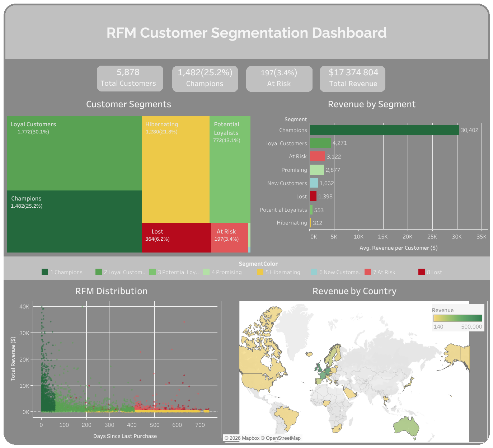

# 🛍️ RFM Customer Segmentation

> Segmenting 5,878 customers of a UK-based online retailer 
> using RFM analysis to drive targeted marketing decisions.

## 🔗 Links
- 📓 [Google Colab Notebook](notebook/RFM_Customer_Segmentation_Analysis_|_Online_Retail_Dataset.ipynb)
- 📊 [Tableau Dashboard](https://public.tableau.com/app/profile/kristina.vasylenko/viz/RFM_17767786912690/Dashboard1)

---

## 📌 Project Overview

This project performs **RFM (Recency, Frequency, Monetary)** 
analysis on a real e-commerce dataset to segment customers 
and provide actionable business recommendations.

**Dataset:** Online Retail II — UCI Machine Learning Repository  
**Period:** December 2009 – December 2011  
**Source:** [Kaggle](https://www.kaggle.com/datasets/mashlyn/online-retail-ii-uci)

---

## 📊 Dataset

| Parameter | Value |
|-----------|-------|
| Raw transactions | 1,067,371 |
| After cleaning | 779,425 |
| Unique customers | 5,878 |
| Countries | 41 |
| Total Revenue | $17,374,804 |
| Period | 2009–2011 |

---

## 🧹 Data Cleaning

- Removed rows without `Customer ID` (23% missing)
- Filtered out returns (`Quantity < 0`)
- Removed zero-price records
- Dropped duplicates
- Converted `InvoiceDate` to datetime
- Added `Revenue = Quantity × Price`

---

## 🧠 RFM Methodology

| Metric | Description | Better when |
|--------|-------------|-------------|
| **Recency** | Days since last purchase | Lower ↓ |
| **Frequency** | Number of unique orders | Higher ↑ |
| **Monetary** | Total revenue generated | Higher ↑ |

Each metric scored **1–5** using `pd.qcut()` → combined into **RFM Score**

---

## 👥 Customer Segments

| Segment | Customers | Share | Description |
|---------|-----------|-------|-------------|
| Champions | 1,482 | 25.2% | Buy often, recently, spend most |
| Loyal Customers | 1,772 | 30.1% | Regular buyers |
| Potential Loyalists | 772 | 13.1% | Recent with growth potential |
| Promising | 9 | 0.2% | New with good signs |
| Hibernating | 1,280 | 21.8% | Used to buy, now inactive |
| New Customers | 2 | 0.03% | Just joined |
| At Risk | 197 | 3.4% | Champions going silent |
| Lost | 364 | 6.2% | Haven't bought in a long time |

---

## 💡 Key Insights & Recommendations

**1. Strong loyal base ✅**

55% of customers = Champions + Loyal Customers
→ Launch VIP loyalty program to retain them

**2. Hibernating customers ⚠️**
22% (1,280 customers) — were active, now gone
→ Win-back email campaign with 15% discount

**3. At Risk segment 🚨**
197 high-value customers showing declining activity
→ Personalized offers needed immediately

**4. Geographic concentration 🌍**
83% of revenue comes from UK alone
→ Invest in Germany, France, Australia markets

**5. Champions drive revenue 💰**
25% of customers generate the majority of revenue
→ Focus retention budget on this segment

---

## 📈 Tableau Dashboard

**Features:**
- Customer Segments Treemap
- RFM Distribution Scatter Plot
- Revenue by Segment Bar Chart
- Revenue by Country Map
- Interactive segment filter

---

## 🛠️ Tools & Technologies

| Tool | Purpose |
|------|---------|
| Python | Data cleaning & RFM calculation |
| Pandas | Data manipulation |
| Matplotlib / Seaborn | Visualizations |
| Google Colab | Development environment |
| Tableau Public | Interactive dashboard |
